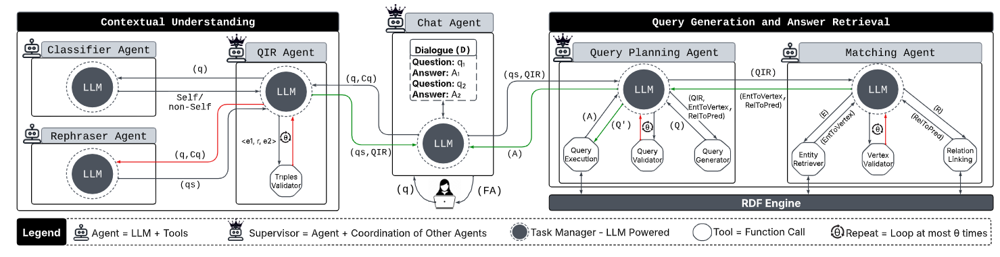

 ChattyKG: An LLM-Powered Dialogue Platform for KGs 
 ---
 - - - - -

Abstract
-------
Conversational Question Answering over Knowledge Graphs (KGs) combines the factual grounding of KG-based QA with the interactive nature of dialogue systems. KGs are widely used in domain-specific and enterprise applications to provide structured, reliable knowledge. Large language models (LLMs) enable context-aware conversations. However, they often lack reliable grounding in these specialized settings, limiting their trustworthiness for domain-specific tasks. Traditional KGQA systems provide reliable answers by querying structured KGs, but usually support only single-turn questions with high latency. They also struggle with multi-turn dialogue challenges like coreference and context tracking. To overcome these limitations, we propose Chatty-KG, a modular multi-agent AI system for conversational question answering over KGs. Chatty-KG uses specialized agents that dynamically collaborate for contextual understanding, dialogue tracking, entity and relation linking, and structured query generation. This enables accurate and low-latency translation of natural language multi-turn questions into executable SPARQL queries. Our extensive experiments on large and diverse KGs show that Chatty-KG significantly outperforms state-of-the-art baselines in both single-turn and multi-turn QA, achieving higher F1 scores and consistency. Its modular design preserves dialogue coherence and handles context-dependent reasoning without fine-tuning. Evaluations with commercial (e.g., GPT-4o, Gemini-2.0) and open-weight (e.g., Phi-4, Gemma 3) LLMs confirm broad compatibility and stable performance. Overall, Chatty-KG unifies factual grounding with conversational adaptability to offer a scalable and extensible solution for reliable multi-turn KGQA.



Running ChattyKG
-------------
- - - - 

### Installation
 
* Clone the repo
* Create `venv` Conda environment (Python >= 3.10) and install pip requirements.
```
conda create --name venv
conda activate venv
pip install -r requirements.txt
```

### Download the required Embedding:
- Download wiki-news-300d-1M.zip from this [link](https://fasttext.cc/docs/en/english-vectors.html)
- Extract the downloaded script
- Create Data directory
- Move the extracted file to the data directory

### Running ChattyKG

ChattyKG uses a similarity module for relation linking, a pre-requisite step is to run the module server using the following command
 ```
 conda activate venv
 python word_embedding/server.py 127.0.0.1 9600
 ```

ChattyKG takes as an input a JSON file containing all questions in the following format:
```
{
    "question": 
    [
        {
            "string": question text
            "language": "en"
        }
   ],
   "id": question id,
   "answers": []
}
```
* To run ChattyKG in this mode, you need a script that opens the questions' file then calls ChattyKG module to answer the questions.
* To call the ChattyKG module you should use the following code:

```python
from chattykg import ChattyKG

my_chattykg = ChattyKG()
answers = my_chattykg.ask(question_text=question_text, question_id=question['id'], knowledge_graph=knowledge_graph)
```

